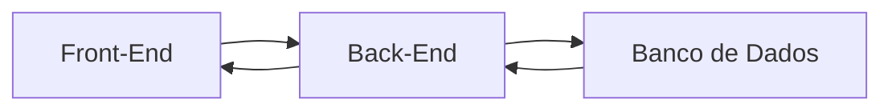

# Meu curso desenvolvimento com antigravity

**Início:** 19/09/2026
**Local:** Escola Senai Americana

## Módulo 1 - Introdução e Nivelamento

- Hardware, Software e Sistemas Operacionais

- Preparando o Ambiente de Desenvolvimento
    - VSCode: Editor de texto / IDE;
    - Criação da WorkSpace;
    - Arquivos e Extensões;
    - Sotwares de versionamento;
    > Versionamento: Processo de registrar e gerenciar todas as alterações feitas nos arquivos de um projeto ao longo do tempo. 
        - GIT: Versionamento Local;
        - GITHub: Versionamento na Nuvem;

### Configurando o GIT e GITHUB

Conectar GIT ao GITHUB, digitar o seguinte comando no bash ou cmd:

`git config --global user.name "SeuUserName"`

`git config --global user.email "seu@email.com"`

confirmar com o comando:
`git config --list`

### O processo de desenvolvimento

**"Como o software é feito"**
* Programar é dar ordens extremamente detalhadas e lógicas para o computador. É como escrever uma receita de bolo passo a passo

**Arquitetura básica de um software**

* Front-End (A Interface): É tudo que o usuário vê, clica e interage.
* Back-End (O Cérebro): É a cozinha do restaurante. Recebe as requisições, processa de acordo com a lógica e devolve uma resposta para a UI (User Interface);
* Banco de Dados (A memória): É onde guardamos as informações permanentes: logins, senhas, históricos, mensagens...

### Meu Primeiro Projeto Antigravity

**O Contexto (O que vamos construir)**

* Gerenciador de tarefas: HTML, CSS, Javascript

* O Prompt para o Antigravity: 

