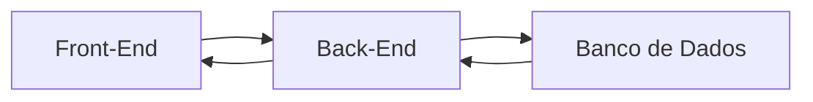

# Meu curso desenvolvimento com antigravity

**Início:** 19/09/2026
**Local:** Escola Senai Americana

## Módulo 1 - Introdução e Nivelamento

- Hardware, Software e Sistemas Operacionais

- Preparando o Ambiente de Desenvolvimento
    - VSCode: Editor de texto / IDE;
    - Criação da WorkSpace;
    - Arquivos e Extensões;
    - Sotwares de versionamento;
    > Versionamento: Processo de registrar e gerenciar todas as alterações feitas nos arquivos de um projeto ao longo do tempo. 
        - GIT: Versionamento Local;
        - GITHub: Versionamento na Nuvem;

### Configurando o GIT e GITHUB

Conectar GIT ao GITHUB, digitar o seguinte comando no bash ou cmd:

`git config --global user.name "SeuUserName"`

`git config --global user.email "seu@email.com"`

confirmar com o comando:
`git config --list`

### O processo de desenvolvimento

**"Como o software é feito"**
* Programar é dar ordens extremamente detalhadas e lógicas para o computador. É como escrever uma receita de bolo passo a passo

**Arquitetura básica de um software**

* Front-End (A Interface): É tudo que o usuário vê, clica e interage.
* Back-End (O Cérebro): É a cozinha do restaurante. Recebe as requisições, processa de acordo com a lógica e devolve uma resposta para a UI (User Interface);
* Banco de Dados (A memória): É onde guardamos as informações permanentes: logins, senhas, históricos, mensagens...

```mermaid

flowchart LR
    A[Front-End]
    B[Back-End]
    C[Banco de Dados]

A --> B
B --> C
C --> B
B --> A
    
```

### Meu Primeiro Projeto Antigravity

**O Contexto (O que vamos construir)**

* Gerenciador de tarefas: HTML, CSS, Javascript

* O Prompt para o Antigravity: 

1. **Os Dados**: 
    * Sem dados, não existe aprendizado. No mundo digital, os dados são bibliotecas inteiras de textos, páginas da web, repositórios de código aberto (como o GitHub), manuais técnicos, imagens e conversas.
    * Quanto maior o volume, a diversidade e a qualidade dos dados, melhor será a base de conhecimento disponível.

2. **O Algoritmo**:
    * O algoritmo não é a inteligência em si; é o **método matemático** pelo qual a máquina lê os dados, identifica padrões, ajusta erros e calibra seus cálculos.

3. **O Modelo**:
    * Após meses de processamento massivo em supercomputadores na nuvem consumindo petabytes de dados através de algoritmos complexos, o resultado final gerado é um arquivo com bilhões de pesos matemáticos chamado **Modelo**

> Obs: Quando você abre o chat ou utiliza uma API de IA, você não está conversando com a internet em tempo real nem com um algoritmo em treinamento; você está interagindo diretamente com o **Modelo**, que é o cérebro consolidado contendo os padrões aprendidos.

### IA Tradicional  vs. IA Generativa

A IA Tradicional foca em responder perguntas como:
* *"Esta transação com cartão de crédito é legítima ou fraudulenta?"*
* *"Este e-mail recebido é spam ou prioritário?"*
* *"Qual a chance de chover em Curitiba amanhã?"*
* *"Qual filme do catálogo da Netflix este usuário provavelmente assistirá?"*

A IA Generativa dá um salto conceitual: a partir dos padrões absorvidos durante o treinamento, ela é capaz de **gerar artefatos digitais totalmente novos e inéditos**.
* Ela não faz apenas a busca de um texto pronto em um banco de dados; ela escreve palavra por palavra uma dissertação inédita.
* Ela não copia um layout existente; ela projeta uma tela em HTML/CSS baseada nas instruções recebidas.
* Ela não apenas classifica uma imagem médica; ela pode gerar representações sintéticas para pesquisa.

### LLM (Large Language Model): Como funciona um Modelo de Linguagem?

1. **Token**: O texto de entrada não é lido pelo modelo como palavras inteiras. Ele é decomposto em fragmentos (tokens). Um texto com 100 caracteres irá consumir aproximadamente 25 tokens (num texto padrão em inglês)
2. **Previsão Sequencial**: A tarefa primária de um LLM é calcular continuamente os `Dados do Contexto` --> qual é o próximo `token` mais provável?
3. **Padrão e Contexto**: Ao Analisar bilhoes de linhas de códigos e textos de alta qualidade, o modelo aprende que apos um token qual é o próximo token
Ex.: function `somanumeros` (é matematicamente provável que venha os parâmetros da função) a sugestão da IA é `(numero1 , numero2)`

### o Desenvolvimento com Uso da IA

#### A Anatomia do Requisito ####

**2. Situação de Aprendizagem: Estudo de Caso Prático**

**O Desafio:**

Os alunos, em grupos, atuarão como analistas. Eles receberão um "Briefing" (um texto bagunçado com falas do dono da startup) e deverão organizar as informações.

**Tarefa dos Grupos:**

1. **Identificar 3 Requisitos:** (Ex: Visualizar fotos dos pratos; Pagar via Pix; Confirmar entrega via código).
2. **Identificar 2 Regras de Negócio:** (Ex: Raio máximo de 10km; Frete grátis acima de R$ 50,00).
3. **Identificar 1 Restrição:** (Ex: Somente pagamento via Pix - exclusão de outros meios).

### **"Horta-na-Mão" (Assinatura de Orgânicos)**

**Contexto:** Focado em saúde e recorrência. O cliente não compra uma vez só, ele assina uma cesta semanal.

**O Briefing do Cliente:**

"Eu quero digitalizar meu clube de orgânicos. O esquema é o seguinte: o cliente escolhe um plano (Pequeno, Médio ou Grande) e recebe toda terça-feira. Mas atenção: ele só pode trocar os itens da cesta até domingo à noite; se passar disso, vai o que tiver na horta. O pagamento tem que ser recorrente no cartão de crédito, estilo Netflix. Outra coisa, só entregamos na Zona Sul da cidade porque meu caminhão é velho e não aguenta subir ladeira. O entregador precisa tirar uma foto da cesta na porta do cliente para provar que entregou, já que muita gente mora em casa e não tem porteiro."

**Gabarito para o Professor:**

- **Requisitos:** Gestão de planos de assinatura; Substituição de itens da cesta; Upload de foto para comprovação de entrega.
- **Regras de Negócio:** Troca de itens permitida apenas até domingo; Pagamento exclusivamente recorrente.
- **Restrição:** Limitação geográfica (apenas Zona Sul); Pagamento apenas via Cartão de Crédito.

---

### **"Coffee-Work" (Catering Corporativo)**

**Contexto:** Focado em B2B (empresas). O volume é grande e a pontualidade é crítica.

**O Briefing do Cliente:**

"Nosso negócio é levar café da manhã e lanches para reuniões de empresas. Não é como pedir um lanche individual. O pedido mínimo é de R$ 200,00. As empresas precisam obrigatoriamente informar o CNPJ e a Inscrição Estadual para emitirmos a Nota Fiscal eletrônica na hora. Os pedidos precisam ser feitos com no mínimo 24 horas de antecedência; nada de pedidos para o mesmo dia! O sistema tem que rodar em tablets antigos (Android 7) que os nossos chefes de cozinha já possuem. E o frete? O frete é fixo: 20 reais para qualquer lugar, mas se a empresa for parceira 'Diamante', o frete some."

**Gabarito para o Professor:**

- **Requisitos:** Cadastro de CNPJ/Dados fiscais; Emissão de NF-e automática; Módulo de agendamento de pedidos.
- **Regras de Negócio:** Pedido mínimo de R$ 200,00; Antecedência mínima de 24h; Frete grátis para parceiros 'Diamante'.
- **Restrição:** Compatibilidade com Android 7 (Legado); Frete com valor fixo.

### **"Gelada-Já" (Bebidas e Conveniência Noturna)**

**Contexto:** Focado em agilidade e conformidade legal (álcool).

**O Briefing do Cliente:**

"Meu app é para quem acabou a bebida no meio da festa. O foco é velocidade: prometemos entregar em até 20 minutos, ou o cliente ganha um cupom de 50% na próxima compra. Por lei, eu preciso garantir que o comprador é maior de 18 anos, então o app tem que pedir uma foto do RG antes de finalizar a primeira compra. Nosso estoque é muito dinâmico, então se o estoque marcar zero, o produto tem que sumir do app instantaneamente. Ah, e como a gente mexe com integração de estoque pesada, o sistema não pode suportar mais que 500 usuários logados ao mesmo tempo para não travar nosso servidor atual que é bem simples."

**Gabarito para o Professor:**

- **Requisitos:** Upload e validação de foto de documento; Sincronização de estoque em tempo real; Sistema de cupons automáticos por atraso.
- **Regras de Negócio:** Entrega em 20 min ou desconto de 50%;
- **Restrição:** Limite de escalabilidade (máximo 500 usuários simultâneos); Integração obrigatória com o banco de dados do estoque atual.Proibida venda para menores de 18 anos.

### Prompt para o Stich para Geração do Protótipo do Aplicativo 

